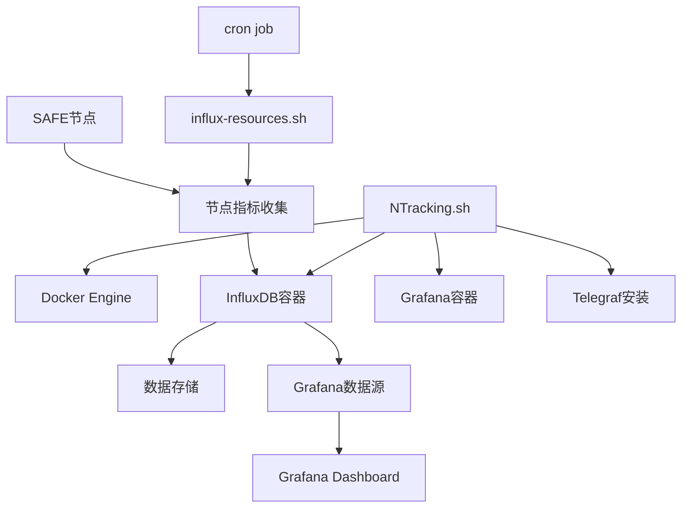

# NTracking项目架构文档

## 项目元数据
- **项目名称**: NTracking
- **技术栈**: Bash, Docker, InfluxDB, Grafana, Telegraf
- **仓库位置**: GitHub - safenetforum-community/NTracking
- **部署状态**: 已成功部署
- **主要组件**: 监控系统，数据收集，可视化仪表板
- **最后更新**: 2024-02-18

## 项目概览
NTracking是一个为SAFE Network节点提供监控和数据可视化的工具套件。该项目使用InfluxDB存储时序数据，Telegraf收集节点数据，Grafana进行数据可视化，全部通过Docker进行容器化部署和管理。系统允许节点运营者实时监控节点性能、网络状态和奖励数据，提供全面的运营视图。

## 项目目录结构与文件职责
```
NTracking/                     # 项目根目录
├── NTracking.sh               # 主要安装和配置脚本，提供交互式菜单
├── influx-resources.sh        # 数据收集脚本，从节点获取指标并发送到InfluxDB
├── NTracking Dashboard        # Grafana仪表板配置JSON文件
├── README.md                  # 项目说明文档
├── push.sh                    # 代码推送辅助脚本
├── neo.sh                     # 辅助脚本
├── anm/                       # SAFE Node Manager相关文件
├── movenode/                  # 节点移动相关工具
├── .github/                   # GitHub相关配置
├── .gitignore                 # Git忽略配置
├── PROJECT_ARCHITECTURE.md    # 项目架构文档(本文件)
└── AI_COLLABORATION_GUIDE.md  # AI协作指南
```

## 核心组件与依赖关系

### 1. NTracking.sh（主配置脚本）
- **主要功能**: 
  - 提供交互式Whiptail菜单界面
  - 安装Docker引擎
  - 配置和部署InfluxDB和Grafana
  - 安装和配置Telegraf
  - 提供系统卸载功能
- **依赖**: 
  - Whiptail (用户界面)
  - Docker (容器化)
  - Bash (脚本环境)

### 2. influx-resources.sh（数据收集脚本）
- **主要功能**:
  - 从运行中的SAFE节点收集指标
  - 格式化数据以供InfluxDB使用
  - 计算节点总体统计数据
  - 监控性能和网络状态
- **收集的核心指标**:
  - 节点状态(运行/停止)
  - 节点性能(CPU使用率、内存使用)
  - 网络连接(连接的对等点、网络大小)
  - 记录统计(PUT/GET操作)
  - 奖励余额
  - 被屏蔽计数

### 3. NTracking Dashboard（Grafana仪表板配置）
- **主要功能**:
  - 可视化节点性能指标
  - 提供网络概览
  - 显示奖励和运营统计数据
  - 实时监控节点状态
- **依赖**:
  - Grafana
  - InfluxDB数据源

### 4. Docker组件
- **InfluxDB容器**:
  - 存储时序数据
  - 提供数据查询和管理API
  - 默认运行在端口8086
- **Grafana容器**:
  - 提供数据可视化界面
  - 连接到InfluxDB数据源
  - 默认运行在端口3000
- **Telegraf**:
  - 系统级指标收集
  - 将数据推送到InfluxDB

### 5. 组件依赖图


## 数据流动与处理逻辑

### 1. 数据收集流程
```
SAFE节点(metrics endpoint) 
→ influx-resources.sh脚本(每15分钟通过cron执行) 
→ 收集节点指标 
→ 格式化为InfluxDB行协议 
→ 发送到InfluxDB 
→ Grafana查询InfluxDB 
→ 在仪表板上显示
```

### 2. 部署流程
```
执行NTracking.sh 
→ 用户选择安装选项 
→ 安装Docker(如选择) 
→ 配置InfluxDB和Grafana(如选择) 
→ 设置相关密码和端口 
→ 安装Telegraf(如选择) 
→ 配置数据收集cron作业
```

### 3. 监控指标分类
| 指标类别 | 收集的数据点 | 用途 |
|---------|-------------|------|
| 节点状态 | 运行状态、版本、正常运行时间 | 监控节点可用性和稳定性 |
| 网络指标 | 连接的对等点、网络大小、开放连接 | 了解网络连接性和规模 |
| 性能指标 | CPU使用率、内存使用、延迟 | 监控节点性能和资源使用 |
| 存储指标 | 存储的记录数、相关记录、最大记录数 | 监控存储使用情况 |
| 操作指标 | PUT/GET操作、支付计数 | 衡量节点活动和贡献 |
| 奖励指标 | 当前奖励余额 | 跟踪节点收益 |

## 配置文件解析

### 1. NTracking.sh 配置参数
```bash
# 默认配置参数
INFLUXDB_GRAFANA_USER="safe"               # InfluxDB和Grafana默认用户名
GRAFANA_PORT=3000                          # Grafana默认端口
INFLUXDB_GRAFANA_PASSWORD="jidjedewTSuIw4EmqhoOo"  # 默认密码
INFLUXDB_PORT=8086                         # InfluxDB默认端口
INFLUXDB_TOKEN="HYdrv1bCZhsvMhYOq6_wg4NGV2OI9HZch_gh57nquSdAhbjhLMUIeYnCCAoybgJrJlLXRHUnDnz2v-xR0hDt3Q=="  # 默认访问令牌
```

### 2. influx-resources.sh 关键参数
```bash
# 配置参数
WalletAddress=YourWalletAddress            # 用户钱包地址
MetricsPortFirst=13001                     # 第一个节点的指标端口
base_dir="/var/antctl/services"            # 节点服务基础目录
ShunnedValue=15                            # 可接受的被屏蔽值阈值
```

### 3. Docker Compose 配置
NTracking.sh生成并使用以下配置:
- InfluxDB配置位置: `$HOME/.local/share/tig-stack/influxdb/config/config.yml`
- Grafana配置位置: `$HOME/.local/share/tig-stack/grafana/config/`
- 数据存储位置: `$HOME/.local/share/tig-stack/influxdb/data/`

## 操作流程与监控机制

### 1. 数据收集计划
- 通过cron作业每15分钟执行一次influx-resources.sh
- 脚本从所有已配置的节点收集指标
- 并行处理多个节点，但使用sleep语句以避免CPU峰值

### 2. 节点发现机制
- 扫描base_dir目录以确定节点数量
- 对每个节点使用顺序分配的指标端口(从MetricsPortFirst开始)
- 使用curl命令查询节点的metrics和metadata端点

### 3. 监控策略
- 实时监控节点状态和性能
- 跟踪奖励余额的积累
- 检测高屏蔽计数值的节点(ShunnGun功能)
- 监控网络规模和连接性

### 4. 故障处理机制
- 区分运行节点和停止节点
- 为停止的节点保存其最后已知的指标
- 通过Grafana警报可视化潜在问题
- 识别并标记具有高屏蔽值的节点

## 安全考虑因素

### 1. 凭证管理
- 默认用户名和密码可以在安装过程中自定义
- InfluxDB令牌被用于安全数据摄取
- 所有敏感数据在docker-compose配置中通过环境变量传递

### 2. 网络安全
- InfluxDB和Grafana默认只绑定到本地端口
- 使用Docker网络进行容器间通信
- 可以通过防火墙规则进一步保护端口

### 3. 数据保护
- 数据存储在持久化Docker卷中
- 自动备份可通过自定义cron作业实现

## 部署与维护指南

### 1. 安装要求
- 运行Linux系统(Debian/Ubuntu推荐)
- 非root用户账户(具有sudo权限)
- 足够的磁盘空间用于数据存储
- 节点必须启用metrics端点

### 2. 升级流程
如README中所述:
```bash
# 更新资源收集脚本
sudo rm -f /usr/bin/influx-resources.sh* && sudo wget -P /usr/bin https://raw.githubusercontent.com/safenetforum-community/NTracking/main/influx-resources.sh && sudo chmod u+x /usr/bin/influx-resources.sh

# 更新cron作业
echo "*/15 * * * * $USER /usr/bin/mkdir -p /tmp/influx-resources && /bin/bash /usr/bin/influx-resources.sh > /tmp/influx-resources/influx-resources" | sudo tee /etc/cron.d/influx_resources
```

### 3. 数据库重置(必要时)
- 登录InfluxDB
- 删除名为"telegraf"的存储桶
- 创建同名新存储桶

### 4. 常见故障排除
- 检查Docker容器状态: `docker ps`
- 验证数据收集脚本是否在运行: `ps aux | grep influx-resources`
- 检查cron作业配置: `sudo cat /etc/cron.d/influx_resources`
- 查看脚本执行日志: `cat /tmp/influx-resources/influx-resources`

## 项目演化计划
- 增强可视化数据分析能力
- 添加预测模型以识别潜在问题
- 改进节点发现和自动化配置
- 开发节点性能基准测试功能
- 添加跨节点数据聚合和比较功能
- 集成更多安全网络组件的监控 